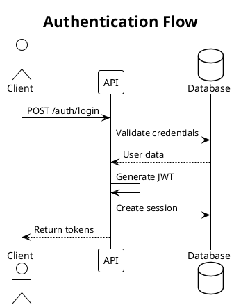
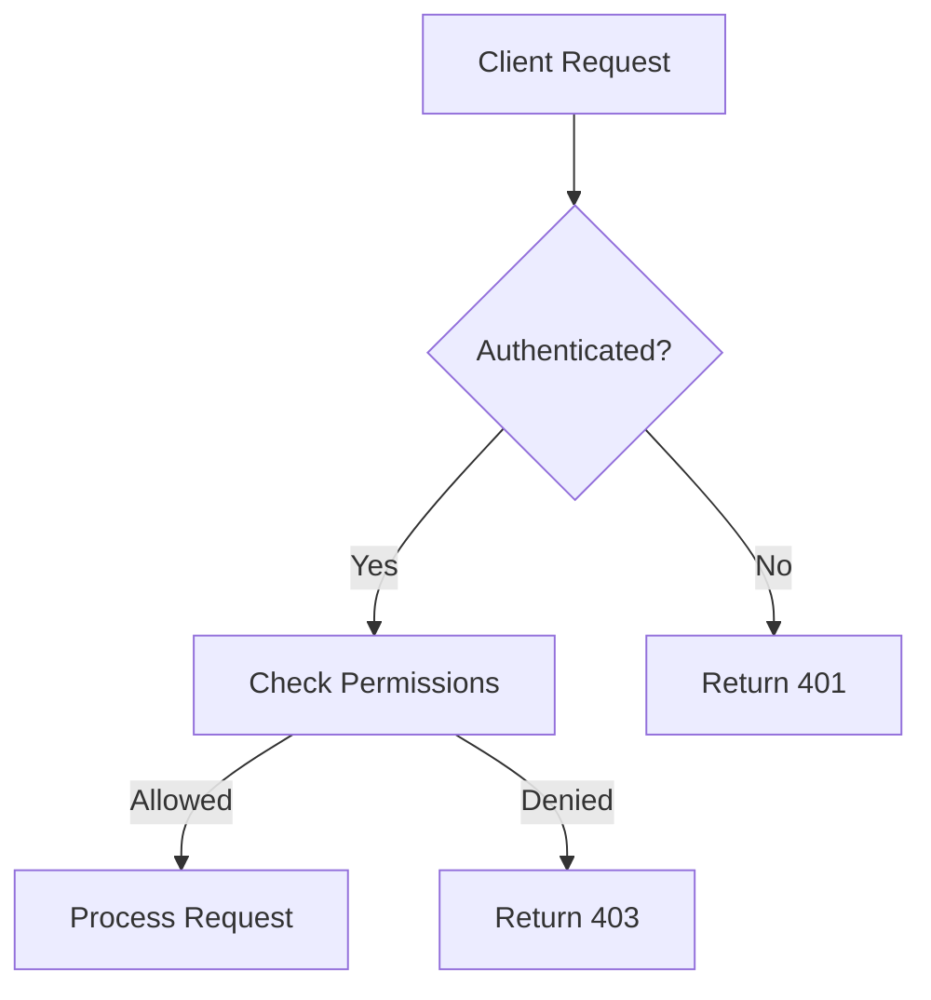

# Documentation Images

This directory contains diagrams and images for the documentation.

## Creating Diagrams

### PlantUML

Install PlantUML:

```bash
# macOS
brew install plantuml

# Ubuntu
sudo apt install plantuml
```

Create diagrams:



Generate PNG:

```bash
plantuml diagram.puml
```

### Mermaid

Create diagrams in markdown:



Render using:
- GitHub (automatic)
- Mermaid Live Editor (https://mermaid.live)
- VS Code Mermaid extension

## Diagram Guidelines

1. Use consistent colors:
   - Blue: External systems
   - Green: Success paths
   - Red: Error paths
   - Gray: Internal components

2. Keep diagrams simple and focused

3. Include legends when necessary

4. Use SVG format when possible (better scaling)

5. Optimize PNG images:
   ```bash
   optipng -o7 diagram.png
   ```

## Recommended Tools

- **PlantUML**: Sequence diagrams, class diagrams
- **Mermaid**: Flow charts, sequence diagrams
- **Excalidraw**: Hand-drawn style diagrams
- **Draw.io**: General purpose diagrams
